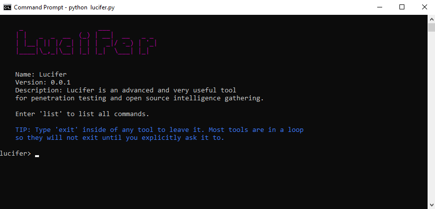

# Lucifer
> Advanced pen-testing and OSI tool.

[![Python Version][python-img]][python-url]
<!-- [![Build Status][travis-image]][travis-url] -->
<!-- [![Downloads Stats][npm-downloads]][python-url] -->

Lucifer is an advanced and very useful tool for penetration testing and open source intelligence gathering.



## Installation

OS X & Linux:

```sh
pip install pipenv
pipenv install
```

Windows:

```sh
pip install pipenv
pipenv install
```

## Usage example

Usage is super simple, to run the script:
```sh
python lucifer.py
```
The following should be shown on your screen:

```
   _                   ___
  | |   _  _  __  (_) | __|  __   _ _
  | |__| || |/ _| | | |  _|/ -_) | '_|
  |____|\_,_|\__| |_| |_|  \___| |_|


  Name: Lucifer
  Version: 0.0.1
  Description: Lucifer is an advanced and very useful tool
  for penetration testing and open source intelligence gathering.

  Enter 'list' to list all commands.

  TIP: Type 'exit' inside of any tool to leave it. Most tools are in a loop
  so they will not exit until you explicitly ask it to.
```

_For more examples and usage, please refer to the [Wiki][wiki]._

<!-- ## Development setup

Describe how to install all development dependencies and how to run an automated test-suite of some kind. Potentially do this for multiple platforms.

```sh
make install
npm test
``` -->

## Release History

* 0.0.1
    * Work in progress

## Meta

Omar Quazi – [@quaziomar](https://instagram.com/quaziomar) – omar@quazi.co

Distributed under the GPL v3 license. See `LICENSE` for more information. See [ChooseALicense](https://choosealicense.com/licenses/gpl-3.0/) for more details on the license.

[https://github.com/blacksector/lucifer](https://github.com/blacksector/lucifer)

## Contributing

1. Fork it (<https://github.com/blacksector/lucifer/fork>)
2. Create your feature branch (`git checkout -b feature/fooBar`)
3. Commit your changes (`git commit -am 'Add some fooBar'`)
4. Push to the branch (`git push origin feature/fooBar`)
5. Create a new Pull Request

<!-- Markdown link & img dfn's -->
[python-img]: https://img.shields.io/badge/Python-2.7-brightgreen.svg?style=flat-square
[python-url]: https://www.python.org/downloads/release/python-2715/
[wiki]: https://github.com/blacksector/lucifer/wiki
